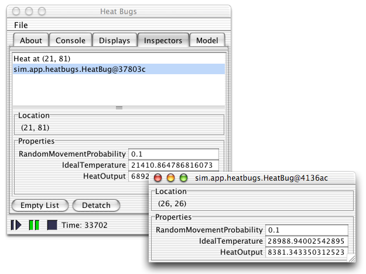
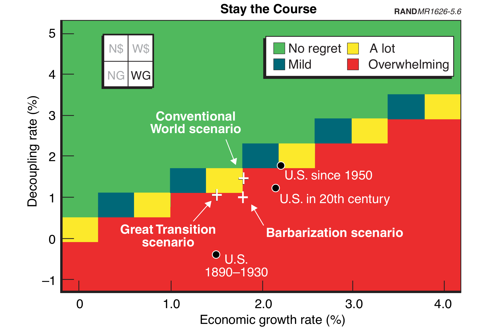

# The Practice of Reproducibility
; TODO Put twitter handle, repo info on each page

# Interactive -> Not Reproducible

## Interactive GUIs

; Instructions to reproduce: Click here, then wait for n seconds, then click here, then right click and export image, save it with this filename...
; Writing a paper based on interactive interface -> Lots of manual work.
; Bad for you (what if you have to re-run?) AND bad for reproducibility.

# Automated -> Reproducible

; Reproducibility: run 1 command, generate an entire paper (run simulation, collect data, generate images, insert into paper, compile LaTeX to PDF)

## Two Tools for Automation

* Dexy - Automate your Project
* Docker - Automate your Environment

## Dexy

* A project & document automation framework.
* Reduce errors, increase maintainability.
* Designed for challenges of ABM...
* ...but more broadly applicable.
* Document software (models, libraries, frameworks).

## Dexy

* Filters execute code, compile markup, do anything else.
* Write documents in any text-based format.
* Add links to source code or artifacts.
* Run dexy to generate static content.
* Iterate (with caching).
* Multiple documents (paper, slides, blog post) from same sources.

## Docker

* Reproducible "containers" (VM Lite)
* Provide Isolation

## Docker + Dexy

* Run an automated project...
* ...in an isolated, reproducible container.
* You or anyone else.

## Example

Here's some configuration:

{{ d['/dexy.yaml|idio']['simulation'] | trim }}

Telling dexy to run this script:

{{ d['/run.sh|idio'] | trim }}

And the result looks like this:

<pre>
{{ d['/run.sh|bash'] | trim | e }}
</pre>

## Generating Data

Here's code in `Students.java` for creating a text file to hold data:

{{ d['Students.java|idio']['write-step-data-header'] | trim }}

We write to this file at each step:

{{ d['Student.java|idio']['write-step-data'] | trim }}

We load it into an R script:

{{ d['/plots.R|idio|rint|pyg']['read-data'] }}

## Make a Plot

We calculate some summary statistics:

{{ d['/plots.R|idio|rint|pyg']['calculate-agitations']  | trim }}

And plot them:

{{ d['/plots.R|idio|rint|pyg']['agitation-plot'] }}

## Plot


The simulation was run for {{ params.numStudents }} agents with 
tempering cut down {{ params.TEMPERING_CUT_DOWN }} and initial tempering random multiplier {{ params.TEMPERING_INITIAL_RANDOM_MULTIPLIER }}.

no tempering.


## Docker

* <http://github.com/ananelson/swarmfest2014>
* GUI requires Xvfb or similar

{{ d['/Dockerfile|idio'] }}

## What next?

[Shaping the Next 100 Years](http://www.rand.org/content/dam/rand/pubs/monograph_reports/2007/MR1626.pdf)

